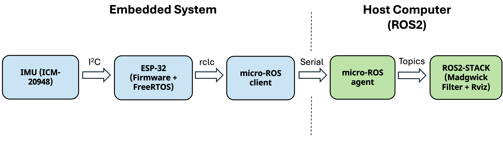

Part of the Fullstack IMU pipeline project:
[**https://github.com/spereira02/Fullstack_imu_filter**]
## Overview

How does raw sensor data become meaningful robot state?

Modern robotics systems are built as pipelines: sensors produce raw measurements, embedded firmware collects and streams them, and higher-level software performs estimation and visualization.

This repository implements the **embedded layer** of that pipeline.

It interfaces an **ICM-20948 9-axis IMU** with an **ESP32** over **I²C**, performs low-level device configuration, and continuously reads accelerometer, gyroscope, and magnetometer measurements inside a dedicated **FreeRTOS task**.

The firmware handles tasks such as:

- IMU register configuration and bank switching  
- power-management setup for stable measurements  
- continuous sensor polling and scaling of raw data  
- streaming IMU data toward a ROS 2 system using **micro-ROS**

The goal is to provide a reliable hardware interface that can feed sensor data into a distributed robotics stack.

## System Architecture

<p align="center">
  
</p>

<p align="center">
End-to-end IMU data pipeline: an ESP32 reads an ICM-20948 sensor via I²C, publishes measurements through a micro-ROS client over serial (XRCE-DDS), and a ROS 2 system performs orientation estimation using the Madgwick filter and visualizes the result in RViz.
</p>

This repository therefore represents **Step 1 of a complete IMU processing pipeline**.

➡️ The full system — including ROS 2 integration, sensor fusion using the **Madgwick filter**, and RViz visualization — is documented in the main project repository:  
**[https://github.com/spereira02/Fullstack_imu_filter]**
## Firmware Architecture

The firmware is structured as a **small real-time data pipeline** rather than a monolithic embedded program. Responsibilities are separated into modules to isolate hardware access, deterministic acquisition timing, and ROS communication.

Runtime data flow:

```
ICM-20948 IMU
      │
      ▼
ICM20948 Driver (I²C)
      │
      ▼
FreeRTOS IMU Task
(sensor polling)
      │
      ▼
Queue (latest sample)
      │
      ▼
micro-ROS Task
      │
      ▼
ROS 2 Topics
```

Two FreeRTOS tasks run concurrently.

### IMU Acquisition Task

Located in:

```
src/imu_task.c
```

Responsibilities:

- initialize and configure the IMU  
- periodically read accelerometer, gyroscope, and magnetometer data  
- convert raw register values into engineering units  
- write the newest sample into a shared queue  

Sampling is performed using:

```
vTaskDelayUntil()
```

This ensures deterministic sampling intervals.

---

### micro-ROS Communication Task

Located in:

```
src/micro_ros_task.c
```

Responsibilities:

- initialize the micro-ROS client  
- configure the serial transport  
- create the ROS node and publishers  
- run the `rclc` executor  
- publish the newest IMU sample  

Separating ROS communication from sensor polling prevents middleware behavior from disturbing hardware timing.

---

## Repository Structure

```
esp32_firmware/
├── components/
│   ├── icm20948/
│   │   ├── icm20948.c
│   │   └── include/icm20948.h
│   └── micro_ros_espidf_component/
│
├── include/
│   ├── project_settings.h
│   ├── imu_task.h
│   ├── micro_ros_task.h
│   └── esp32_serial_transport.h
│
├── src/
│   ├── main.c
│   ├── imu_task.c
│   ├── micro_ros_task.c
│   └── esp32_serial_transport.c
│
└── platformio.ini
```

### Key Modules

**IMU Driver**

```
components/icm20948/
```

Handles:

- I²C communication  
- sensor register configuration  
- sensor data retrieval  
- scaling raw measurements  

---

**FreeRTOS Tasks**

```
src/imu_task.c
src/micro_ros_task.c
```

Responsible for acquisition and ROS communication.

---

**Serial Transport**

```
src/esp32_serial_transport.c
```

Implements the micro-ROS serial transport layer used by the XRCE-DDS middleware.

---

**Main Application**

```
src/main.c
```

Application entry point that initializes shared resources and launches the FreeRTOS tasks.

---

## Wiring

This setup uses the **SparkFun 9DoF IMU Breakout – ICM-20948** communicating with the **ESP32** via **I²C**.

Four connections are required to provide power and establish I²C communication between the devices.

### Connections

| IMU (ICM-20948) | ESP32 |
|-----------------|-------|
| GND             | GND   |
| VIN             | 3V3   |
| SDA             | GPIO 21 (SDA) |
| SCL             | GPIO 22 (SCL) |


### Notes

- The ESP32 operates at **3.3 V logic**, which is compatible with the SparkFun ICM-20948 breakout.
- SparkFun boards already include the required **I²C pull-up resistors**, so no additional hardware is required.
- If using a different IMU breakout, verify that **GND is directly connected to ground** and not tied through a pull-up resistor.

---

## Design Decisions

### Latest-Sample Queue Instead of FIFO Buffer

The IMU task writes to a queue of length **1**, which makes the queue behave as a **latest-value mailbox** rather than a deep history buffer.

Advantages:

- always keeps the newest sensor sample available  
- prevents stale IMU measurements from accumulating  
- keeps latency bounded  
- minimizes memory usage  

For live robotics telemetry, fresh sensor data is usually more valuable than preserving every intermediate sample.

---

### Decoupled Acquisition and Publishing Tasks

Sensor sampling and ROS publication run in **separate FreeRTOS tasks**.

This ensures:

- IMU polling remains periodic and predictable  
- communication failures do not disturb acquisition timing  
- hardware-facing code remains isolated from middleware behavior  

---

### Raw Sensor Data Publishing

The firmware publishes **raw IMU measurements**.

Orientation estimation is intentionally handled in the ROS 2 layer using algorithms such as the **Madgwick filter**, where tuning and experimentation are easier.

---

## Build System

The firmware is built using **PlatformIO** on top of **ESP-IDF**.

PlatformIO manages:

- ESP-IDF toolchain installation  
- compilation and linking  
- flashing firmware to the ESP32  
- serial monitor integration  

---

## Installing Dependencies

This project uses the **micro-ROS ESP-IDF component** as an external dependency.

It is included as a **Git submodule** located in:

```
components/micro_ros_espidf_component
```

Clone the repository together with its submodules:

```bash
git clone --recurse-submodules https://github.com/spereira02/esp32_firmware.git
```

If the repository was already cloned without submodules:

```bash
git submodule update --init --recursive
```

ESP-IDF automatically detects components located in the `components/` directory.

---

## Build and Flash

Build the firmware:

```bash
pio run
```

Flash the firmware to the ESP32:

```bash
pio run --target upload
```

Open a serial monitor:

```bash
pio device monitor
```

---

## micro-ROS Serial Agent Setup (ESP32 → ROS 2)

This guide outlines how to deploy the **micro-ROS Agent**, which bridges communication between the ESP32 client and the ROS 2 graph via serial transport.

> **Note**  
> This setup is validated for **ROS 2 Jazzy**.  
> For other ROS distributions replace `jazzy` with the corresponding version.

---

### 1. Install the micro-ROS Agent

Create a workspace and clone the agent repository:

```bash
mkdir -p uros_ws/src
cd uros_ws/src
git clone -b jazzy https://github.com/micro-ROS/micro-ROS-Agent.git
```

Install dependencies:

```bash
cd ..
rosdep update
rosdep install --from-paths src --ignore-src -r -y
```

Build the workspace:

```bash
colcon build --symlink-install
source install/local_setup.bash
```

Verify installation:

```bash
ros2 pkg list | grep micro_ros_agent
```

---

### 2. Configure Serial Permissions

Add your user to the `dialout` group:

```bash
sudo usermod -a -G dialout $USER
```

Log out and back in for the change to take effect.

Verify with:

```bash
groups
```

---

### 3. Identify the ESP32 Serial Port

Connect the ESP32 and run:

```bash
ls /dev/ttyUSB*
ls /dev/ttyACM*
```

Typical output:

```
/dev/ttyUSB0
```

---

### 4. Start the micro-ROS Agent

```bash
source /opt/ros/jazzy/setup.bash
source install/local_setup.bash

ros2 run micro_ros_agent micro_ros_agent serial --dev /dev/ttyUSB0
```

---

### 5. Synchronize the Client

Once the agent is running, press the **RST button on the ESP32** to establish the session.

Expected output resembles:

```
[info] session established
[info] participant created
[info] topic created
[info] datawriter created
```

---

### 6. Verify ROS 2 Telemetry

Open a new terminal and source ROS:

```bash
source /opt/ros/jazzy/setup.bash
```

List topics:

```bash
ros2 topic list
```

Example:

```
/imu/data_raw
```

Echo the IMU stream:

```bash
ros2 topic echo /imu/data_raw
```

---

## Troubleshooting

### Local Coordinate Frame

The SparkFun **ICM-20948 9DoF IMU Breakout** has a coordinate frame engraved on the PCB that appears to follow the **NED (North-East-Down)** convention.

However, when manually reading the sensor registers and verifying the axes through testing, the measured data did **not** match the expected NED orientation. Instead, the sensor outputs correspond to a **NWU (North-West-Up)** coordinate frame.

This discrepancy became apparent during debugging when comparing physical IMU movements with the resulting axis readings.

---

### Serial Port Access

Ensure no other programs (Arduino IDE, serial monitors, etc.) are accessing the port.

---

### Reset Requirement

After starting the micro-ROS agent, press the **RST button on the ESP32** to establish the connection.

---

### Architecture Issues

If deploying on a **Raspberry Pi 5**, ensure the `uros_ws` workspace was built locally on the Pi so the binaries match the ARM64 architecture.

---

## What This Project Demonstrates

From an **embedded systems perspective**:

- low-level I²C sensor integration  
- ESP-IDF component-based firmware architecture  
- FreeRTOS task scheduling and queue communication  
- micro-ROS transport on a resource-constrained microcontroller  

From a **robotics systems perspective**:

- bridging embedded sensor data into a ROS 2 computation graph  
- separating acquisition, transport, and estimation layers  
- the embedded foundation of a complete IMU filtering pipeline  
